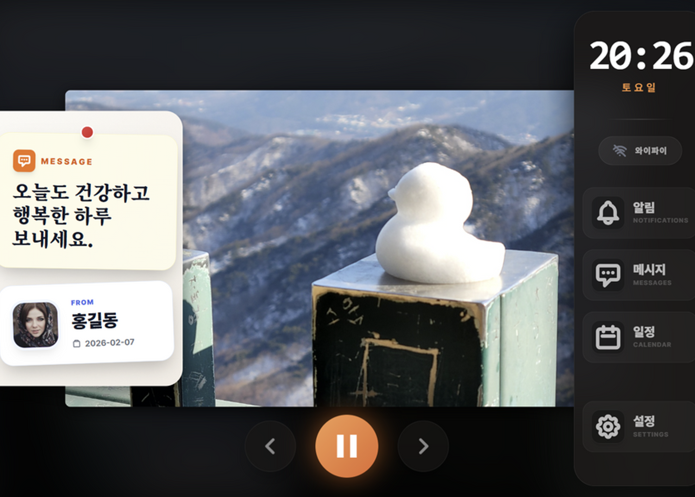
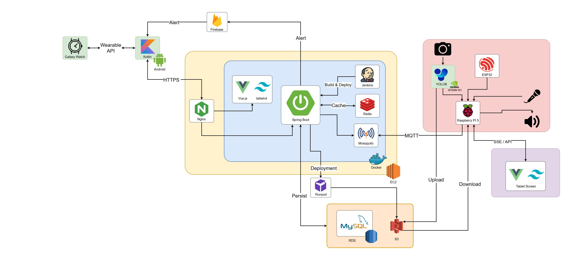
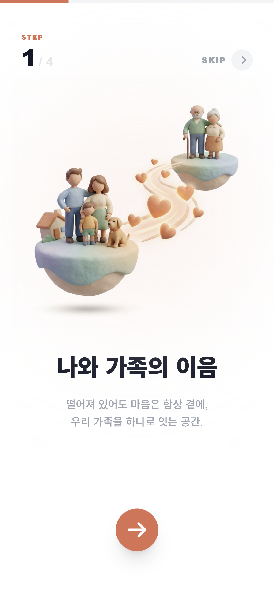
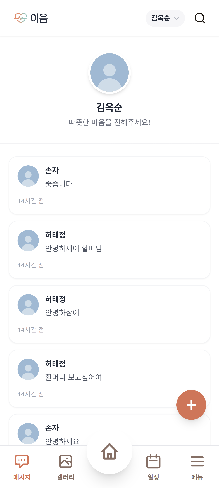
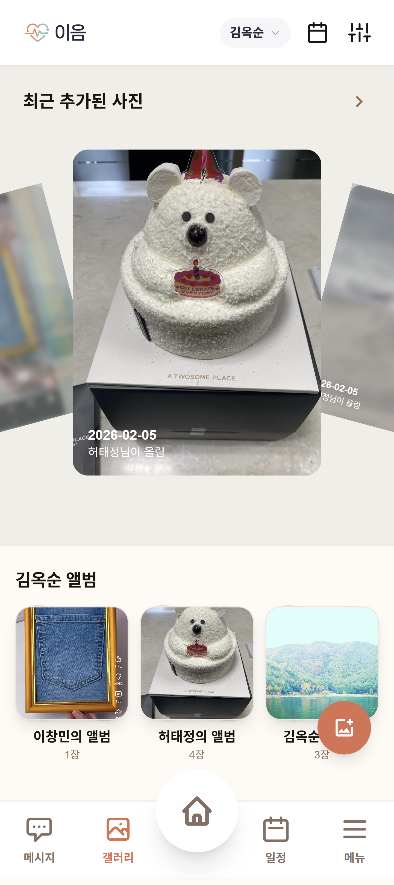
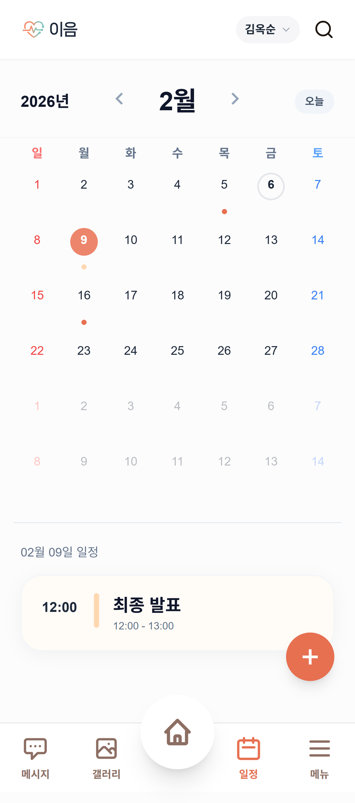
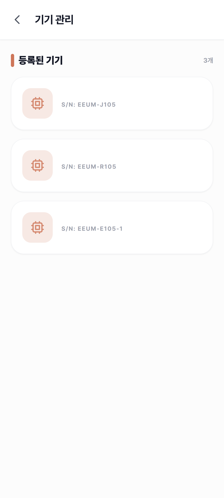
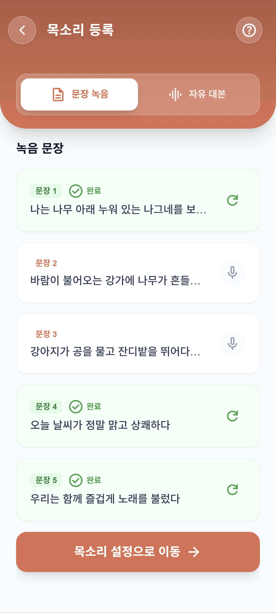
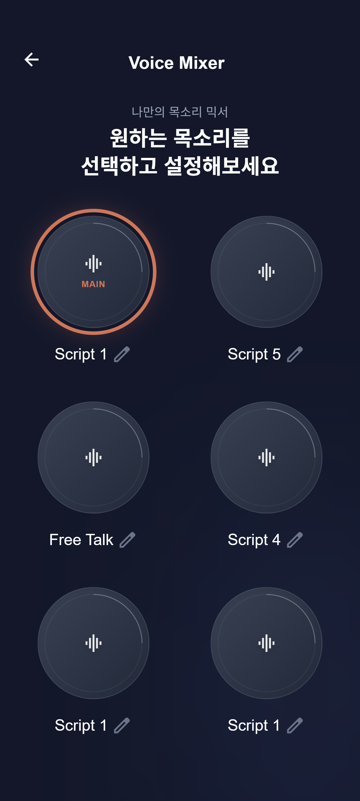
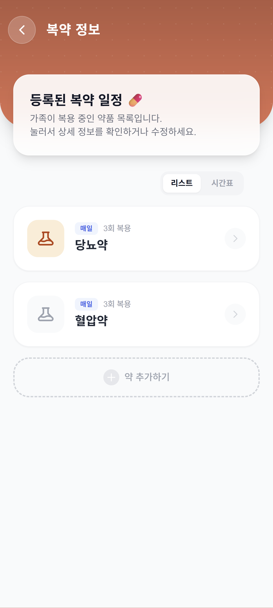

# EEUM (이음) - 스마트 돌봄 & 연결 플랫폼



## 1. 프로젝트 개요

- **기간**: 2026.02.09 – 2026.04.03 (6인)
- **유형**: Web · AI · IoT 통합 스마트 케어 플랫폼
- **목표**: 독거 노인의 안전 관리와 정서적 연결을 동시에 제공하는  
  **Edge–Cloud 기반 AI 돌봄 시스템 구축**

### 핵심 키워드

- Edge AI 낙상 감지 (YOLOv8 Pose)
- Sensor Fusion 기반 오탐 최소화 (Vision + PIR)
- Voice Cloning 기반 정서 케어
- MQTT · HTTP 기반 하이브리드 통신 구조
- Edge–Cloud–External AI 연동 아키텍처

---

## 2. 역할

### 황가연 Fullstack & AI (기여도 30%)

- Spring Boot 기반 백엔드 API 설계 및 성능 최적화
- AI 음성 생성 파이프라인 비동기 처리 및 캐싱 구조 설계
- Web(Vue) 프론트엔드 주요 기능 구현
- 메시지/알림 시스템 설계 및 FCM 연동

---

## 3. 기획 의도

기존 독거 노인 케어 시스템은 단순 감지 및 알림 중심으로,  
**정서적 케어와 지속적인 연결 경험이 부족**한 한계가 존재합니다.

이에 따라 본 프로젝트는  
**기술을 통한 ‘안전 + 정서’ 통합 케어 구조**를 설계했습니다.

> AI = 감지 (위험 인식)  
> Voice = 연결 (정서 전달)

**"기술이 가족을 대신하는 것이 아니라, 이어주는 역할을 한다"**

단순한 모니터링 시스템이 아닌,  
**가족의 존재감을 전달하는 스마트 돌봄 플랫폼**을 목표로 합니다.

---

## 4. 주요 기능

### 실시간 안전 모니터링 & 낙상 감지

- **Edge AI 기반 낙상 감지**: 라즈베리파이와 카메라를 이용해, **온디바이스 AI (YOLOv8 Pose)** 가 실시간으로 넘어짐을 정밀하게 분석합니다.
- **오작동 최소화 (Sensor Fusion)**: PIR 모션 센서와 비전 AI를 결합하여 단순 움직임과 실제 낙상을 정확히 구분합니다.
- **골든타임 확보**: 낙상 감지 즉시 보호자 앱으로 **긴급 알림 (FCM)** 을 발송하고, 119 신고 연동 등 빠른 대처를 돕습니다.

### AI 음성 복제 & 정서 케어

- **보호자 목소리 재현 (Voice Cloning)**: 단 몇 문장만 녹음해도 AI가 이를 학습하여, 언제든 자녀의 목소리로 부모님께 메시지를 읽어드립니다.
- **따뜻한 교감**: 딱딱한 기계음 대신, 익숙한 가족의 목소리로 **투약 알림**과 안부 인사를 전달하여 정서적 고립감을 해소합니다.
- **가족 앨범 & 메시지**: 가족들이 올린 사진과 음성 메시지를 통해 멀리 떨어져 있어도 항상 연결된 느낌을 제공합니다.

### 헬스케어 & 스마트 라이프

- **갤럭시 워치 건강 모니터링**: **Samsung Health SDK**를 연동하여 부모님의 실시간 심박수와 활동량을 정밀하게 체크합니다.
- **스마트 일정 브리핑**: 매일 아침, 가족의 목소리로 오늘의 일정, 복약 시간을 브리핑해 드립니다.

---

## 5. 시스템 아키텍처

이음(EEUM) 서비스의 전체적인 데이터 흐름과 아키텍처입니다.



---

## 6. 기술 스택

### Backend


### Frontend (Web)


### Mobile (Android)


### AI & IoT (Edge)


### Infra


### Communication


---

## 7. 화면 구성

| 인보딩 | 메시지 전송 | 메인화면 | 일정 관리 | 기기 관리 |
| :---: | :---: | :---: | :---: | :---: |
|  |  |  |  |  |
| **목소리 학습** | **샘플 목소리** | **심박수 측정** | **복약 관리** | **알림 조회** |
|  |  |  |  |  |
<br>


## 8. 디렉토리 구조

```
/
├── backend/                       # Spring Boot 백엔드 서버
│   ├── src/main/java/org/ssafy/eeum/
│   │   ├── domain/                # 도메인별 비즈니스 로직
│   │   │   ├── album/             # 사진 앨범 관리
│   │   │   ├── auth/              # 인증/인가 (JWT, OAuth2)
│   │   │   ├── family/            # 가족 그룹 및 구성원 관리 로직
│   │   │   ├── health/            # 건강 데이터(심박수) 처리
│   │   │   ├── iot/               # IoT 디바이스 제어 및 연동
│   │   │   ├── medication/        # 복약 정보 및 스케줄 관리
│   │   │   ├── message/           # 메시지 전송 및 관리
│   │   │   ├── notification/      # 알림(FCM) 처리
│   │   │   ├── schedule/          # 일정 관리
│   │   │   ├── users/             # 사용자 정보 및 권한 관리
│   │   │   └── voice/             # AI 음성 합성 및 TTS 생성 관리
│   │   └── global/                # 전역 설정 (Config, Exception, Util)
│   └── build.gradle               # Gradle 빌드 스크립트
│
├── frontend/                      # Vue 3 웹 프론트엔드
│   ├── src/
│   │   ├── views/                 # 화면 페이지 (Page Components)
│   │   ├── components/            # 재사용 가능한 UI 컴포넌트
│   │   ├── stores/                # Pinia 전역 상태 관리
│   │   ├── services/              # Axios API 통신 모듈
│   │   └── router/                # 라우팅 설정
│   └── package.json               # NPM 의존성 관리
│
├── mobile/                        # Android 모바일 애플리케이션
│   ├── app/src/main/java/com/example/eeum/
│   │   ├── ui/                    # UI 계층 (Activity, Fragment, ViewModel)
│   │   ├── data/                  # 데이터 계층 (Repository, DataSource)
│   │   ├── di/                    # 의존성 주입 (Hilt)
│   │   └── network/               # Retrofit API 인터페이스
│   └── build.gradle.kts           # Kotlin DSL 빌드 스크립트
│
├── IoT/                           # IoT 디바이스 코드
│    └── apps/
│       ├── rpi5-fastapi/          # 라즈베리파이 엣지 게이트웨이
│       └── esp32-pir-sender/      # ESP32 모션 감지 센서 펌웨어
│
└── edge_app/                      # 젯슨 오린 나노 실행 코드
    ├── app/
    │   ├── api/                   # 서버, RPI 통신 코드
    │   ├── auth/                  # 디바이스 인증 코드
    │   ├── core/                  # 낙상 관련 핵심 기능 코드
    │   ├── engine/                # 촬영 코드
    │   ├── modes/                 # QR, Live 모드 코드
    │   ├── state/                 # 디바이스 상태 관리
    │   ├── utils/                 # 부가 기능 관리 코드
    │   └── main.py                # 메인 코드
    ├── Dockerfie                  # 젯슨 도커 파일
    ├── docker-compose.yml         # 젯슨 도커 compose 빌드 파일
    └── yolov8s-pose.engine        # YOLOv8s 모델 텐서 엔진
```

---

## 9. 기여 (핵심 트러블 슈팅 및 성능 최적화)

서버 운영 중 발생했던 주요 병목들을 분석하고, **k6 부하 테스트를 통한 데이터 기반의 성능 튜닝**을 진행했습니다. 이를 바탕으로 대규모 트래픽 부하 상황에도 견딜 수 있는 안정성을 확보했습니다.

### ① AI 서버 성능 한계 돌파 : 음성 메시지 전송 로직 비동기화 및 캐싱

- **문제 상황** : 사용자 메시지가 AI 서버를 거쳐 음성화되는 과정에서, 부하 시(동접 처리) 최대 30초의 지연과 타임아웃 발생 (2.2 RPS).
- **원인 분석** : 무거운 모델의 AI 동기적 처리 과정에서 서버 쓰레드가 블락되었고, 매번 똑같은 화자의 목소리 샘플을 S3에서 재발급 및 렌더링하고 있었습니다.
- **해결 방안** :
  - **비동기 도입** : `asyncio + to_thread` 기반으로 AI 추론 작업을 워커 쓰레드로 격리하여 이벤트 루프 차단을 방지했습니다.
  - **결과 캐싱** : S3 URL을 MD5 로 해싱하여 로컬 스토리지에 화자 모델을 **Cache**함으로써 재요청 및 렌더링 과정을 대폭 생략시켰습니다.
- **결과** : 응답 속도 **28초 → 670ms 단축 (약 40배 향상)** 및 동시 접속 **50 VUs 한계치에서도 95% 이상의 안정적 성공률** 확보.

### ② 백엔드 병목 해결 : N+1 고질적 문제 및 Network 과부하 해결

- **문제 상황** : 100명이 메세지 조회 시 평균 응답속도가 **17.2초**에 달하였고, 통신 패킷량이 800KB를 넘어서는 과부하가 확인되었습니다.
- **원인 분석** : 과거 메시지 전체를 한 번에 조회하며 수백 개의 발신자 정보를 루프마다 가져오는 **JPA N+1 쿼리 문제**가 근본적인 문제였습니다.
- **해결 방안** :
  - 엔티티 패치 조인(`JOIN FETCH`)을 통해 한 번의 쿼리로 Message와 연관된 맴버(Sender) 정보를 일괄 조회했습니다.
  - Pageable 객체를 도입하여 **페이지네이션**을 적용, 최근 20개의 메시지씩 끊어서 가져오도록 로직을 수정했습니다.
- **결과** : 응답 속도 **17.21초 → 58.6ms 단축 (293배 성능 최적화)** 및 1요청 트래픽 데이터 **800KB → 12.3KB 경량화(98% 감소)**.

### ③ 불안정한 IoT 네트워크 신호 유실 대응

- **문제 상황** : 무선 환경에 위치한 Edge 디바이스들의 연결 불안정 탓에 치명적이어야 할 낙상/건강 이벤트가 유실되는 경우가 확인되었습니다.
- **해결 방안** : MQTT 프로토콜 통신 과정에서 QoS 설정을 높이고 재연결 백오프 로직을 적용, 서버 간 상태 동기 API를 설계해 무손실 통신 환경을 구축했습니다.

### 종합 부하 테스트(k6) 지표 성과 요약

| 항목                         | Before      | After                      | 개선율                      |
| ---------------------------- | ----------- | -------------------------- | --------------------------- |
| **조회 API 동시 처리(앨범)** | 과부하 한계 | **1000명 VUs 안정적 수용** | 100% Request Success        |
| **메시지 전송 최적화**       | 28,000ms    | **670ms**                  | 41.7배 향상 (RPS 대폭 개선) |
| **메시지 조회 속도**         | 17,210ms    | **58.6ms**                 | 293배 속도 향상             |
| **조회 데이터 페이로드**     | 800KB       | **12.3KB**                 | 98% 대역폭 감소             |

---

## 10. 프로젝트 회고 및 확장 가능성

### 좋았던 점

- Edge AI 디바이스와 Cloud 서버를 아우르는 **하이브리드 아키텍처를 유기적으로 완성**했습니다.
- k6를 활용한 정량 분석을 기반으로 추측이 아닌 확실한 데이터에 근거한 백엔드/AI 성능 최적화를 경험했습니다.
- 비동기 처리의 필요성 및 캐싱 전략이 가지는 사용자 경험의 강력한 임팩트를 체감할 수 있었습니다.

### 아쉬운 점

- **IoT 통합 시뮬레이션 경험 부족** : 디바이스 하드웨어 특성과 네트워크 지연을 충분히 시뮬레이션하지 못하고 소프트웨어 위주의 테스트만 집중한 점이 향후 아쉬움으로 남습니다. 이로 인해 최종 통합 시연 과정에서 의도했던 플로우가 매끄럽게 연결되지 못했던 변수가 뼈아프게 다가왔습니다.
- **AI 한계점 타파 한계** : 음성 생성 모델의 경량화 등 AI 자체 추론 알고리즘 성능에 대한 장기적 성능 최적화 연구가 부족했습니다.
- **부하 테스트 한계**: 대규모 사용자 환경에서의 장기 부하 테스트를 충분히 수행하지 못한 점이 아쉬움으로 남습니다.

### 향후 확장 전망

- **개인 맞춤화**: 향후 수집된 사용자 행동 및 위치 데이터를 활용하여 개인 맞춤형 케어 서비스로 최적화할 계획입니다.
- **아키텍처 전환**: 서비스 모듈 분리를 통한 마이크로서비스 구조 전환을 검토하여 확장성을 보완할 예정입니다.
- **생태계 확장**: 웨어러블 디바이스 및 스마트홈 연동 범위를 넓히고, 축적된 노인의 헬스케어 데이터를 활용한 이상 징후 예측 모델을 개발하여, 실제 응급 의료 기관 및 구조 센터로 연결되는 통합 관제 시스템으로 확장시킬 수 있습니다.

---

## 11. 팀원 소개

|  |  |  |  |  |  |
| :---: | :---: | :---: | :---: | :---: | :---: |
| **[이창민](https://lab.ssafy.com/tdj5654)**(팀장) | **[김선교](https://lab.ssafy.com/kimsk3568)** | **[손홍헌](https://lab.ssafy.com/hh001204)** | **[신재웅](https://lab.ssafy.com/sju22)** | **[허태정](https://lab.ssafy.com/htj7613)** | **[황가연](https://lab.ssafy.com/ghkdrkdus1)** |
| IoT | IoT | Backend | IoT | Backend | Backend |
| Frontend | AI | AI | Backend | Frontend | Frontend |

---
