# EEUM (이음)

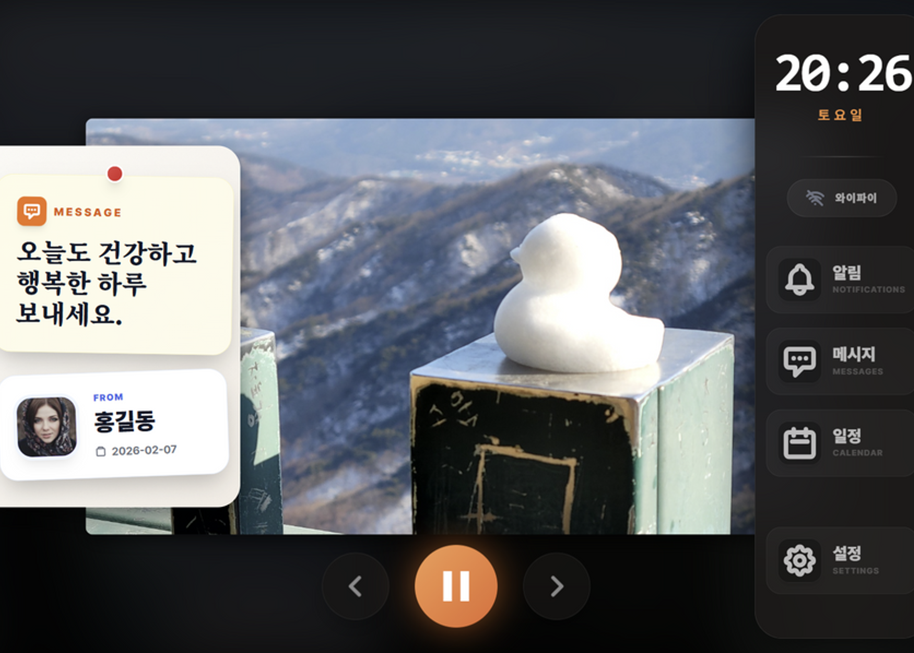

독거 노인의 안전 모니터링과 정서 케어를 위해 보호자 웹·앱, Spring Boot 백엔드, AI 음성 서버와 IoT 기기를 연결한 서비스입니다.

## 프로젝트 개요

| 항목 | 내용 |
| --- | --- |
| 기간 | 2026.01.12 - 2026.02.10 |
| 팀 구성 | 6인 |
| 개인 기여도 | 20% |
| 담당 | Backend · Infra |

## 담당 역할

- Jenkins의 프론트엔드·백엔드 배포 단계를 분리하고 미사용 Docker 이미지 정리 절차 구성
- Docker·Nginx 기반 배포 환경과 HTTPS, API, OAuth Redirect 프록시 경로 구성
- AI 음성 메시지 서버의 반복 다운로드·전처리 구간을 캐싱하고 블로킹 작업 분리
- 메시지 목록 조회의 JPA N+1 문제를 분석하고 Fetch Join과 페이지네이션 적용
- k6 부하 테스트 시나리오와 InfluxDB·Grafana 기반 지표 확인 환경 구성

## 기술 스택

| 영역 | 기술 |
| --- | --- |
| Backend | Java, Spring Boot, Spring Security, JPA, MySQL, Redis |
| Frontend | Vue 3, Vite, Pinia, Tailwind CSS |
| Mobile | Kotlin, Android, Samsung Health SDK |
| AI · IoT | Python, FastAPI, CosyVoice, YOLOv8 Pose, Raspberry Pi, ESP32 |
| Infra · Test | AWS EC2·RDS·S3, Docker, Nginx, Jenkins, k6, InfluxDB, Grafana |

## 시스템 구조

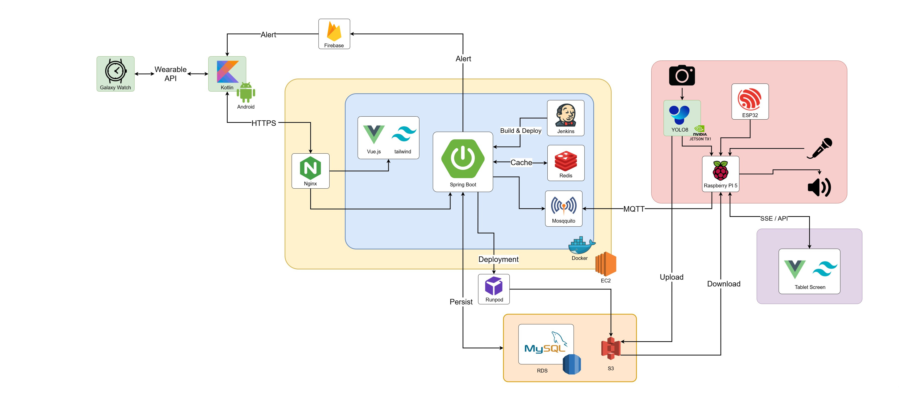

- 보호자 웹·앱에서 메시지, 일정, 건강 정보와 기기를 관리합니다.
- Spring Boot 서버가 인증, 가족 그룹, 메시지, 건강 데이터와 알림 흐름을 처리합니다.
- AI 음성 서버가 보호자 음성 샘플을 이용해 메시지 음성을 생성하고 결과를 S3에 저장합니다.
- Edge 기기가 낙상 이벤트와 건강 데이터를 서버로 전달하고, 서버가 보호자에게 FCM 알림을 전송합니다.

## 핵심 구현

### 1. 프론트엔드·백엔드 배포 흐름 분리

프론트엔드 정적 파일과 백엔드 애플리케이션은 배포 생명주기가 다르지만 기존 Jenkins 과정에서는 함께 배포되고 있었습니다. 한쪽의 빌드나 재기동 문제가 다른 서비스까지 중단시키고, 반복 빌드 과정에서 이전 Docker 이미지도 계속 남았습니다.

- Jenkins에서 프론트엔드와 백엔드 배포 단계를 분리
- 각 서비스의 대상 컨테이너를 독립적으로 빌드하고 재기동하도록 구성
- 배포 후 미사용 Docker 이미지를 정리하는 절차 추가
- Nginx에서 프론트 정적 파일, 백엔드 API, Swagger, OAuth Redirect 경로 분리

이를 통해 코드 변경 범위에 맞는 서비스만 다시 배포하고, 배포 간섭과 이미지 누적으로 인한 스토리지 부족 위험을 줄였습니다.

### 2. AI 음성 메시지 처리 구조 개선

동일한 보호자 음성 샘플을 요청마다 S3에서 다시 내려받고 전처리했으며, 다운로드부터 TTS 추론과 업로드까지 요청 흐름에서 실행되어 이벤트 루프가 오래 점유될 수 있었습니다.

- S3 URL을 MD5로 해싱해 캐시 키 생성
- 16kHz Mono로 변환한 음성 샘플을 로컬에 저장하고 재사용
- S3 다운로드, 오디오 전처리, TTS 추론과 업로드를 `asyncio.to_thread`로 분리
- 무거운 작업이 FastAPI 이벤트 루프를 직접 차단하지 않도록 처리

전후 테스트의 VU와 실행 조건이 달라 응답 시간 수치를 직접 비교하지 않고, 코드로 확인할 수 있는 구조 변경을 중심으로 기록했습니다.

### 3. 메시지 조회의 N+1과 조회 범위 개선

메시지 목록을 조회한 뒤 발신자와 가족 구성원 정보를 반복해서 가져오면서 연관 조회가 증가했고, 과거 메시지를 한 번에 반환해 조회 범위도 불필요하게 컸습니다.

- 메시지와 발신자 정보를 Fetch Join으로 함께 조회
- `page`와 `size`를 받는 Pageable 기반 조회 적용
- 기본 조회 범위를 최근 메시지 20건으로 제한

N+1 제거와 페이지네이션이 동시에 적용됐으므로 두 효과를 하나의 성능 수치로 합치지 않고 각각의 변경 내용을 분리했습니다.

### 4. 부하 테스트 환경 구성

- 메시지 전송·조회, 건강 데이터 업로드, 낙상 이력과 리포트 API의 k6 시나리오 작성
- k6 결과를 InfluxDB에 저장하고 Grafana에서 응답 시간과 실패율 확인
- 테스트 대상 주소와 인증 토큰을 각각 `BASE_URL`, `AUTH_TOKEN` 환경변수로 분리

```bash
k6 run \
  -e BASE_URL=https://example.com/api \
  -e AUTH_TOKEN=your_access_token \
  load-test/message_get.js
```

실제 토큰은 저장소에 기록하지 않습니다.

## 주요 기능

- Edge AI와 PIR 센서를 이용한 낙상 감지 및 보호자 FCM 알림
- 보호자 음성 샘플을 활용한 AI 음성 메시지 생성
- 가족 앨범, 일정과 복약 정보 관리
- Samsung Health SDK 기반 심박수와 활동량 연동
- 보호자 웹과 Android 앱을 통한 사용자·기기 관리

## 화면

| 온보딩 | 메시지 전송 | 메인 화면 | 일정 관리 | 기기 관리 |
| :---: | :---: | :---: | :---: | :---: |
| 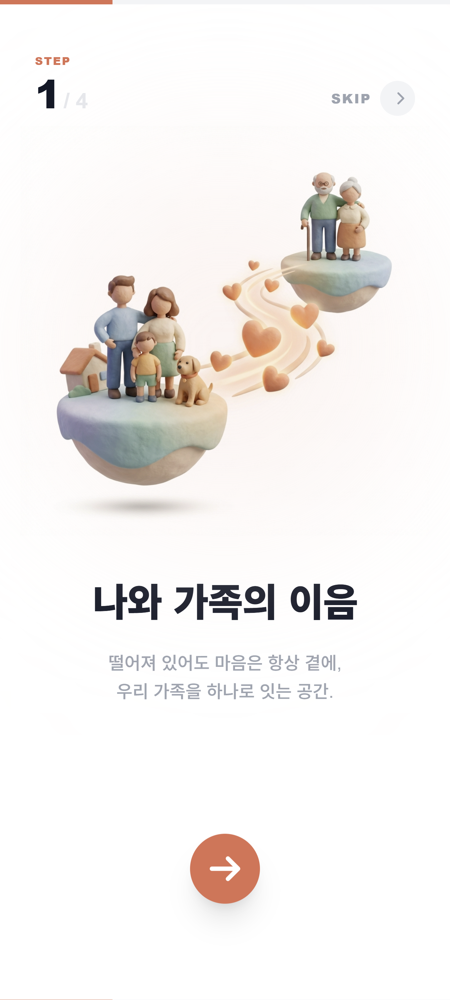 | 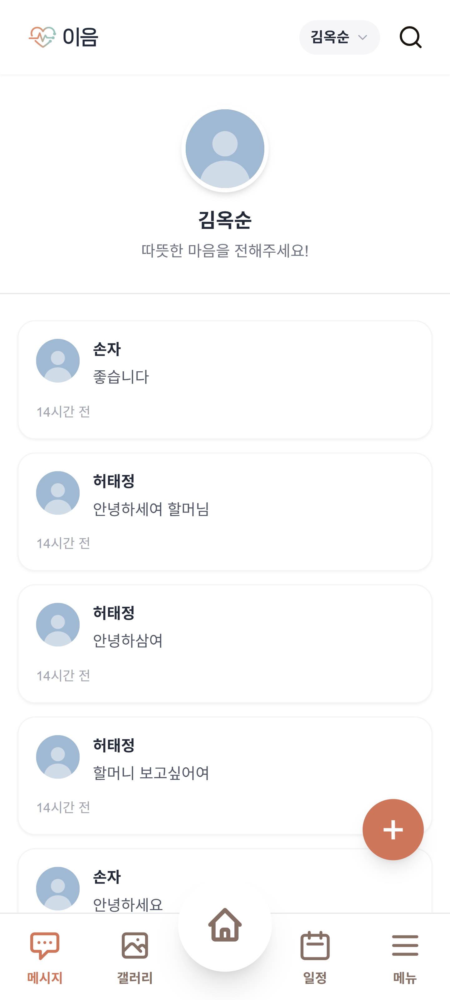 | 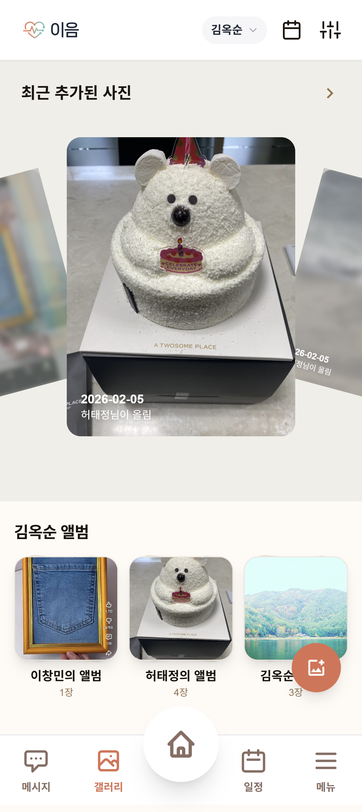 | 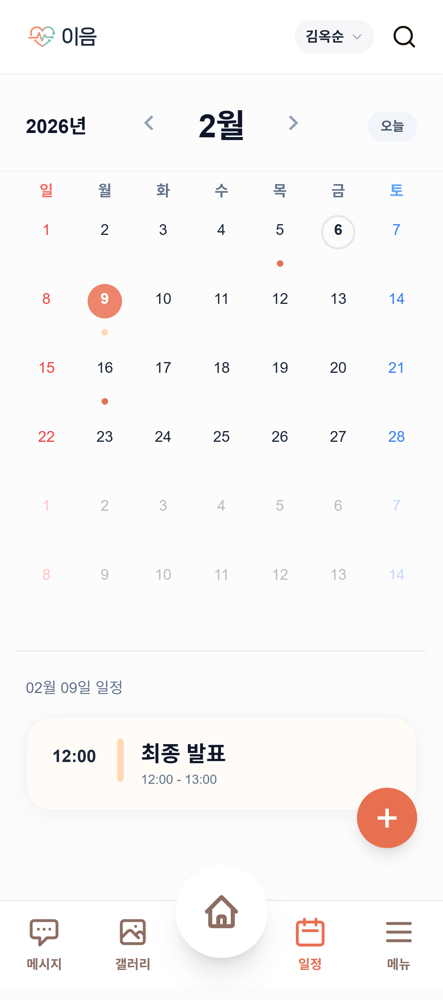 | 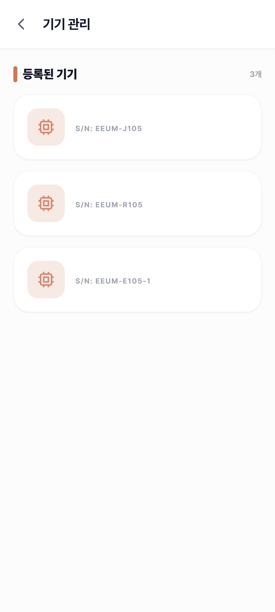 |
| **목소리 학습** | **샘플 목소리** | **심박수 측정** | **복약 관리** | **알림 조회** |
| 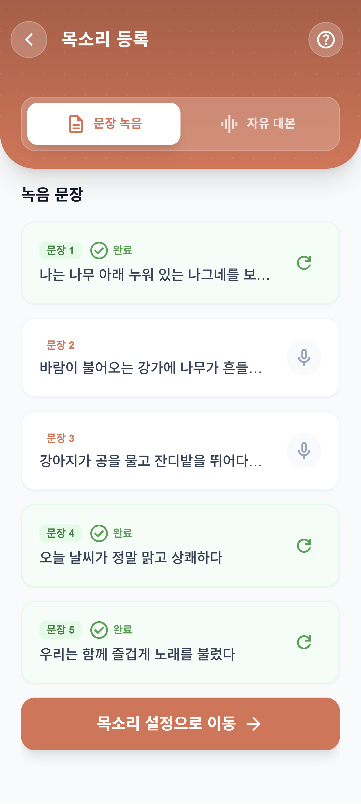 | 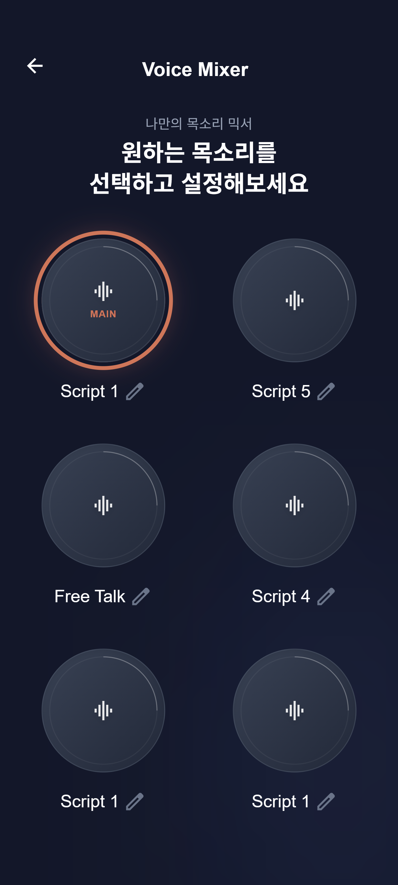 | 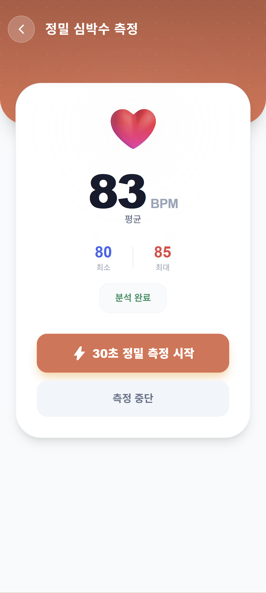 | 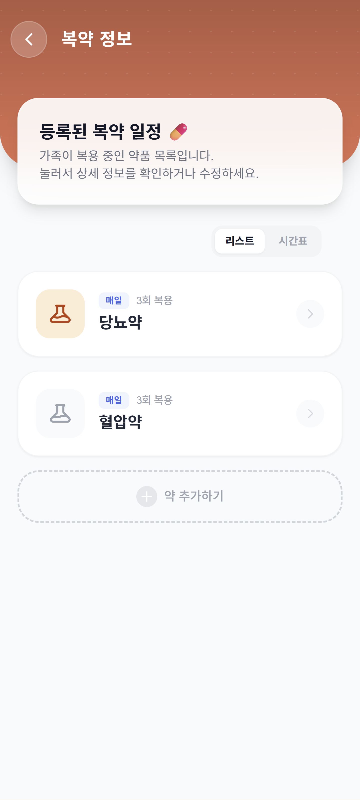 | 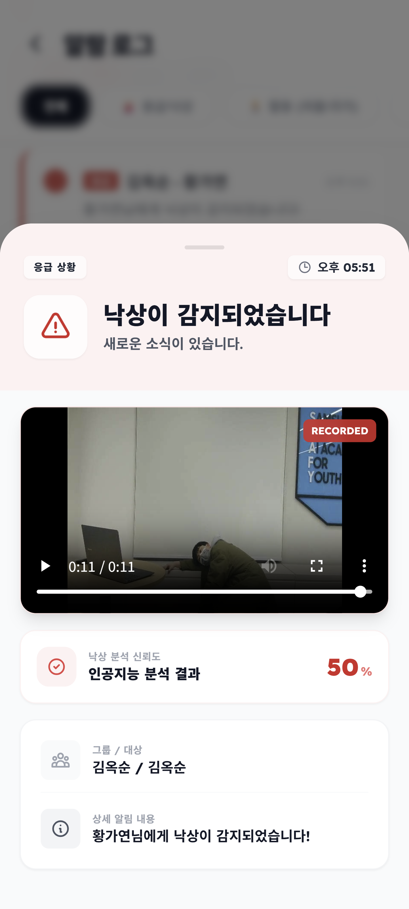 |

## 디렉터리 구조

```text
.
├── backend/      # Spring Boot API 서버
├── frontend/     # Vue 보호자 웹
├── mobile/       # Android 애플리케이션
├── IoT/          # Raspberry Pi·ESP32 코드
├── edge_app/     # Edge 낙상 감지 애플리케이션
├── load-test/    # k6 시나리오와 모니터링 환경
└── docs/         # 화면 및 아키텍처 자료
```
